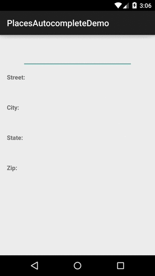

# android-PlacesAutocompleteTextView

[](https://travis-ci.org/seatgeek/android-PlacesAutocompleteTextView) [](https://android-arsenal.com/details/1/2777)

An AutocompleteTextView that interacts with the [Google Maps Places API](https://developers.google.com/places/web-service/autocomplete)
to provide location results and caches selected results in a history file for later use



### Installing

The `PlacesAutocompleteTextView` is available from the sonatype snapshots repository.
Use the following in your `build.gradle`:

```groovy
repositories {
    maven { url 'https://oss.sonatype.org/content/repositories/snapshots' }
}

dependencies {
    compile 'com.seatgeek:placesautocomplete:0.3-SNAPSHOT'
}
```

### Basic setup and usage

1. You'll need a Google Server API key for you application. There are instructions on how to set up your API project and generate a key [here](https://developers.google.com/places/web-service/get-api-key)

2. Your application will need the `android.permission.INTERNET` permission in its manifest for the
View to interact with the Google Maps API

3. With your API key, you're ready to add the `PlacesAutocompleteTextView` to your layout xml:

    ```xml
   <com.seatgeek.placesautocomplete.PlacesAutocompleteTextView
       android:id="@+id/places_autocomplete"
       android:layout_width="match_parent"
       android:layout_height="wrap_content"
       app:pacv_googleMapsApiKey="<YOUR_GOOGLE_API_KEY>"/>
    ```
4. Finally, you'll likely want a listener in your UI to know when the user has selected an item from the dropdown:

    ```java
   placesAutocomplete.setOnPlaceSelectedListener(
           new OnPlaceSelectedListener() {
               @Override
               public void onPlaceSelected(final Place place) {
                  // do something awesome with the selected place
               }
           }
   );
    ```
5. That's it!

_Note: you can treat the `PlacesAutocompleteTextView` the same as any `AutocompleteTextView`
as it extends from the framework `AutocompleteTextView`. This means you can use
custom styles with all the standard view properties._

### Advanced usage/customization

#### XML properties

There are a few XML properties that can control some of the functionality of the autocomplete view:

xml property | java method | description
--- | --- | ---
`pacv_historyFile` | `setHistoryManager()` | By default, the `PlacesAutocompleteTextView` will save the history of the selected `Place`'s in a file on the file system. This is great for cases when your user may be typing in the same address in different parts of your UI or across different sessions. If you'd like to simply change the location of the file on the filesystem, you can specify the path string here. By default, the file is stored in the application cache dir under `autocomplete/pacv_history.json`. If this is a feature that you'd like to disable, you can set the property in xml to `@null` or call `setHistoryManager(null)`.
`pacv_resultType` | `setResultType()` | The Places API can return various types of `Place`s depending on what your application is looking to allow the user to select. By default, the `PlacesAutocompleteTextView` only requests items of type `address`, which returns locations associated with a full postal address, public or residential. You can change this to also be `geocode` for any address or `establishment` for non-residential addresses
`pacv_adapterClass` | `setAdapter()` | If you don't like the default `Adapter` for displaying the items in the dropdown list (it is pretty basic by default), you can override it by specifying your own in xml (by passing the fully-qualified classname) or using `setAdapter()`. An important note: because of how the filtering functionality works in the `PlacesAutocompleteTextView`, your custom adapter must extend `AbstractPlacesAutocompleteAdapter`.
`pacv_clearEnabled` | `showClearButton()` | Show the typicall X button to the right of the `PlacesAutocompleteTextView` to let user clear the text. Defaults to false. Other methods for controlling the clear button is `setImgClearButton()` Override the default Clear image and add your own, `setOnClearListener()` Override the clear listener like what should happen when the X is pressed, default is clear text, `showClearButton()` show/hide it.

#### Limited support for filtering result by country. 
The Google Place Autocomplete service is a web service that returns place predictions in response to an HTTP request.
Currently, you can filter by up to 5 countries. Countries must be passed as a two character, ISO 3166-1 Alpha-2 compatible country code. 
For example: it(Italy), us(USA) or cc the Cocos (Keeling) Islands. See the demo app for example of this.

#### Need more details? `PlaceDetails`

One of the requirements of our usage of this view was autofilling the payment and shipping addresses
in our checkout flow. By default, the returned `Place` from the Google Maps API doesn't have the
full set of address components (city, state, postal, street address, etc.) and instead provides it
"conveniently" in a human readable string like "235 Park Ave South, New York, NY 10003". Which is
probably pretty tricky to parse to get the address components. Enter the
["Place Details" API](https://developers.google.com/places/web-service/details). The
`PlacesAutocompleteTextView` provides a helper method `getDetailsFor(Place, DetailsCallback)` that
you can use to easily fetch the extra details that you might need. The `PlaceDetails` object has a
lot more than just address components as well, so if you're building a complex UI around a location,
this is probably the API call that you'll need to make.

If you have concerns about configuration changes while the details request is in-flight, you can
grab the instance of the `PlacesApi` from `PlacesAutoCompleteTextView#getApi()` and manage the
details request yourself.

See the example project for this API in use.

#### Getting stylish

The `PlacesAutocompleteTextView` is styleable using the `pacv_placesAutoCompleteTextViewStyle`
global style attribute. The style should extend from `PACV.Widget.PlacesAutoCompleteTextView` to
get the default style's parameters, e.g.:

`styles.xml`:
```xml
        <style name="Widget.PlacesAutoCompleteTextView.Styled"
               parent="PACV.Widget.PlacesAutoCompleteTextView">
            <item name="android:background">@drawable/my_edit_text_background</item>
            <item name="android:textAppearance">@style/MyTextAppearance</item>
        </style>
```

`themes.xml`:
```xml
        <style name="AppTheme" parent="@style/YourParentStyle">
            <item name="pacv_placesAutoCompleteTextViewStyle">@style/Widget.PlacesAutoCompleteTextView.Styled</item>
        </style>
```

#### Location biasing

A common thing that you might want to do is bias the place results to the location of the user.
By default, the `PlacesAutocompleteTextView` will bias the results by a geoip lookup of
the device's IP address. If your app has different requirements for where you want to bias the
address results to or you want more accuracy than a geoip lookup, you can pass an Android
`Location` into the `PlacesAutocompleteTextView` using the `#setCurrentLocation()` method.

You can tweak the biasing radius by using the `setRadiusMeters(Long)` method.

If you'd like to disable biasing completely, you can `setLocationBiasEnabled(false)`

### Purpose and "why not use Google Play Services?"

This project was started internally before the Places API was released on Google Play Services and
we needed a way to make entering your payment and shipping addresses in our Android app easier. The
reason that this project is still alive and hasn't migrated to Google Play Services is twofold:

  0. It's still impossible to fetch the full `PlaceDetails` from the Google Play Services
  implementation [\[ref\]](https://developers.google.com/places/android-api/place-details), without
  which you cannot get the full breakdown of address components
  0. It handles hooking the UI components to the data for you to accelerate your development
  process. With Google Play Services you still need to create your own `FilterAdapter`,
  `AutocompleteTextView`, etc.

### Contributing

0. Fork this repo and clone your fork
0. Make your desired changes
0. Add tests for your new feature and ensure all tests are passing
0. Commit and push
0. Submit a Pull Request through Github's interface and a project maintainer will
decide your change's fate.

_Note: issues can be submitted via [github issues](https://github.com/seatgeek/android-PlacesAutocompleteTextView/issues/new)_

### License

PlacesAutocompleteTextView is released under a [BSD 2-Clause License](http://opensource.org/licenses/BSD-2-Clause), viewable [here](LICENSE.txt)
